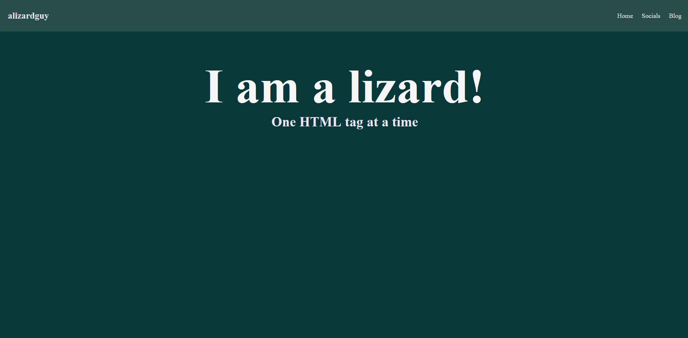
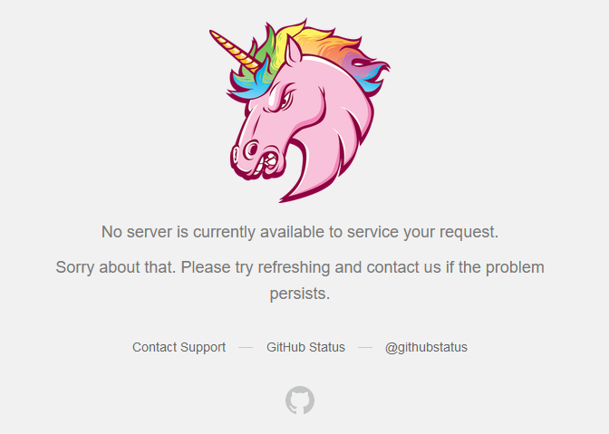

## Life Logs
I decided between techy posts and projects I will try to do smaller "life logs" talking about many subjects at once in a micro blogging collage, you'll be able to find a list of em under the categories tag.

## Blocks and Styles
My current main project I have been working on is the two sections of alizardguy.com

### The Blog
This first and most immediately obvious is the themeing for this blog, I have opted to use [Chirpy](https://chirpy.cotes.page/) for Jekyll for this blog. I chose Chirpy due to it's nice mobile version and the way it displays tags, next up will be working on a nicer way to create posts. Currently I have [Jekyll Compose](https://github.com/jekyll/jekyll-compose) Installed, but I am writing in VSCode with no spellchecker.

### The Site
While alizardguy.com is still in a bit of a rough state, it at least looks like *something* now.

I am building the main site using [11ty](https://www.11ty.dev/) with a Github Action of questionable quality. While I am not going to be directing people to the base [alizardguy.com](https://alizardguy.com/) domain yet as the blog is currently the main focus, I still want there to be something of interest.

## Github's Oopsie
A day ago (now two because midnight rolled over) Github had a [major outage](https://www.theverge.com/2024/8/14/24220685/github-down-website-pull-request) at around 8:26PM ET, this happened as I was trying to link someone to a Github Issue on the [Resonite repo](https://github.com/Yellow-Dog-Man/Resonite-Issues).

## That's all
That is all for this short blog post, I hope to maybe figure out some sort of comment section system in the future. Thanks for reading!