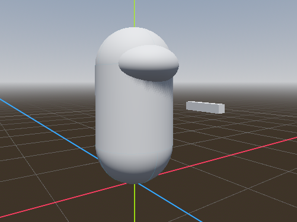

## Intro
Today been a very chill day of playing Minecraft and being sick, spent the later half of my night building a very quick base for a little game I want to design over the weekend.

This project mainly been a practice in trying to break concepts down into generic nodes instead of having one giant player node that tries to do everything, the goal is to keep all gun logic besides the player telling the gun to shoot on the gun itself (this will also allow enemies to use the same guns as the player).

## The bullets
For the first time I am trying rigidbody bullets that will bounce around until they hit something that can "consume" them, the wall in this case is a "shootable" that outputs a hit event when shot. Bullets will be able to determine their travel speed and max life time.

<iframe width="560" height="315" src="https://www.youtube.com/embed/F0DQK31-7nA?si=SjjnUIiCPtxG1dnI" title="YouTube video player" frameborder="0" allow="accelerometer; autoplay; clipboard-write; encrypted-media; gyroscope; picture-in-picture; web-share" referrerpolicy="strict-origin-when-cross-origin" allowfullscreen></iframe>

## The goal
I hope to possibly output a very short game from this, but it is more about learning that trying to get a final product in this case. If I do output anything I'll make sure to throw it up onto my Itch page.